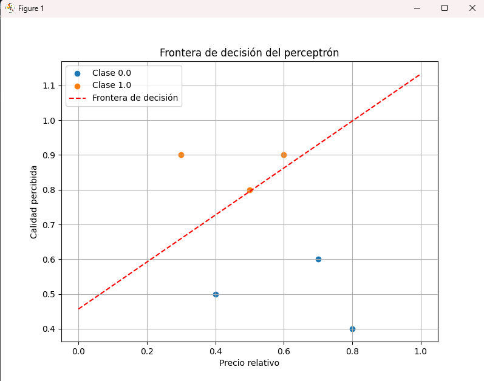

# Clasificación de Productos según su Aceptación por Clientes

## Descripción del Problema
Una empresa desea predecir si un producto será **aceptado** o **rechazado** por los clientes basándose en las siguientes características:

- **Precio relativo**: Precio del producto en comparación con productos similares (normalizado entre 0 y 1).
- **Calidad percibida**: Opinión de los clientes sobre la calidad del producto en encuestas (normalizada entre 0 y 1).

### Criterios de Clasificación
Un producto se considera **aceptado** si cumple:
1. El **precio relativo** es menor o igual a 0.6.
2. La **calidad percibida** es mayor o igual a 0.7.

En caso contrario, será **rechazado**.

### Entradas y Salida del Perceptrón
- **Entradas**:
  - `x1`: Precio relativo (0-1).
  - `x2`: Calidad percibida (0-1).
- **Salida**:
  - `1`: Aceptado.
  - `0`: Rechazado.

---

## Conjunto de Datos de Entrenamiento

| Precio Relativo | Calidad Percibida | Resultado |
|------------------|--------------------|-----------|
| 0.5              | 0.8                | 1         |
| 0.6              | 0.9                | 1         |
| 0.7              | 0.6                | 0         |
| 0.4              | 0.5                | 0         |
| 0.3              | 0.9                | 1         |
| 0.8              | 0.4                | 0         |

---

## Implementación del Perceptrón

### Fórmula del Perceptrón
La salida del perceptrón se calcula como:

y = step(w₁x₁ + w₂x₂ + b)

Donde:
- x₁, x₂: Entradas.
- w₁, w₂: Pesos.
- b: Sesgo.
- step(z): 1 si z ≥ 0, 0 si z < 0.

---

### Algoritmo de Entrenamiento
**Regla de actualización de pesos**:
- wᵢ ← wᵢ + η (yₜᵣᵤₑ - yₚᵣₑd) xᵢ
- b ← b + η (yₜᵣᵤₑ - yₚᵣₑd)

Donde:
- η: Tasa de aprendizaje.
- yₜᵣᵤₑ: Salida esperada.
- yₚᵣₑd: Salida predicha.

---

### Implementación en Python

```python
import numpy as np
import matplotlib.pyplot as plt

# Datos de entrenamiento
data = np.array([
    [0.5, 0.8, 1],
    [0.6, 0.9, 1],
    [0.7, 0.6, 0],
    [0.4, 0.5, 0],
    [0.3, 0.9, 1],
    [0.8, 0.4, 0]
])

X = data[:, :2]  # Entradas
y = data[:, 2]   # Salidas esperadas

# Inicialización de parámetros
w = np.random.rand(2)  # Pesos iniciales
b = np.random.rand()   # Sesgo inicial
eta = 0.1              # Tasa de aprendizaje
epochs = 100           # Número de iteraciones

# Función step
def step(z):
    return 1 if z >= 0 else 0

# Entrenamiento del perceptrón
for epoch in range(epochs):
    for i in range(len(X)):
        z = np.dot(w, X[i]) + b
        y_pred = step(z)
        error = y[i] - y_pred
        w += eta * error * X[i]
        b += eta * error

# Frontera de decisión
x1_vals = np.linspace(0, 1, 100)
x2_vals = -(w[0] * x1_vals + b) / w[1]

# Visualización
plt.figure(figsize=(8, 6))
for i, label in enumerate(np.unique(y)):
    plt.scatter(X[y == label, 0], X[y == label, 1], label=f'Clase {label}')
plt.plot(x1_vals, x2_vals, 'r--', label='Frontera de decisión')
plt.xlabel('Precio relativo')
plt.ylabel('Calidad percibida')
plt.legend()
plt.title('Frontera de decisión del perceptrón')
plt.grid(True)
plt.show()
```

### Graficar



Son muy pocos datos pero podria ayudar 


### ¿Son los datos linealmente separables?

